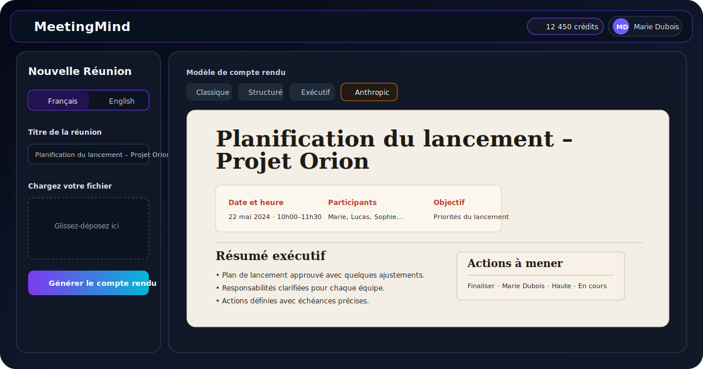
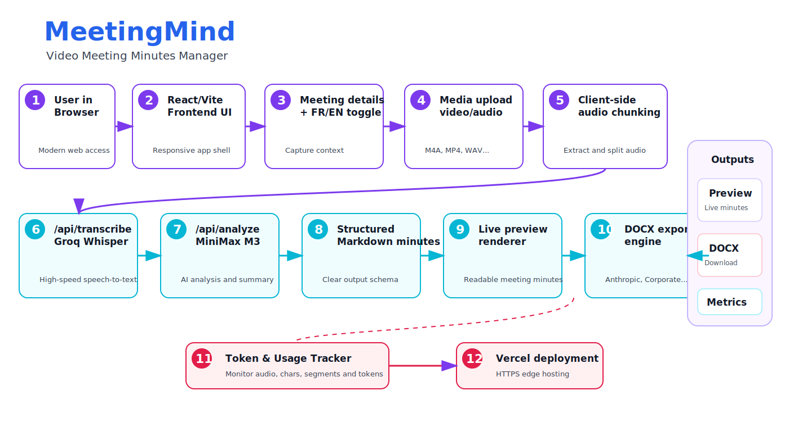

# MeetingMind — Video Meeting Minutes Manager

MeetingMind is a browser-based meeting-minutes generator that turns a recorded video or audio meeting into structured, editable minutes with a live preview and polished DOCX export.

It is designed for project kick-offs, steering committees, workshops, client meetings, and internal follow-ups where the goal is to move quickly from a recording to a usable meeting report.

**Live app:** https://video-meeting-minutes-manager.vercel.app/



## Highlights

- Upload a video or audio meeting recording.
- Extract and chunk audio in the browser before transcription.
- Transcribe recordings through `/api/transcribe` using Groq Whisper.
- Generate structured meeting minutes through `/api/analyze` using MiniMax M3 / MiniMax analysis.
- Choose the output language from the UI: French by default, English optional.
- Preview the generated minutes directly in the web app.
- Export professional DOCX minutes using selectable templates.
- Use the Anthropic-style template for a warm editorial document style.
- Track usage after generation with an expandable token and usage counter.
- Deploy as a Vite app with Vercel serverless API routes.

## What the app generates

The generated minutes are structured around:

- Meeting title as the document H1.
- Executive summary / Résumé exécutif.
- Participants.
- Key discussion points / Points clés discutés.
- Decisions made / Décisions prises.
- Action items / Actions à mener.
- Next meeting / Prochaine réunion.

The generation prompt intentionally avoids unnecessary meeting metadata in the final document, such as meeting type, organized by, recorded by, location, link, and generic footer sections.

## DOCX templates

The DOCX exporter supports several visual styles:

- **Anthropic** — warm editorial style with cream paper background, serif headings, subtle rules, muted red accents, and readable action tables.
- **Corporate** — clean blue business style.
- **Modern** — lighter teal/green presentation style.
- **Executive** — warmer board-report style.

The DOCX export is generated from the same Markdown source used by the website preview so the document structure remains aligned with what the user sees in the app.

## Application flow



1. The user opens the React/Vite application in the browser.
2. The user enters meeting details and selects French or English.
3. The user uploads a video or audio file.
4. The client extracts and chunks the audio.
5. `/api/transcribe` sends chunks to Groq Whisper for transcription.
6. `/api/analyze` sends the merged transcript to MiniMax for structured minutes generation.
7. The app renders a live Markdown preview.
8. The user selects a template and exports the result as DOCX.
9. Token and usage metrics are displayed after generation.
10. The app runs on Vercel with frontend hosting and serverless API routes.

## Main features

### Meeting upload

The UI accepts video and audio recordings, including M4A files. The frontend handles extraction, resampling, and chunk preparation before calling the transcription API.

### Language toggle

The interface supports French and English generation. French is the default because the primary workflow is French-language meeting reporting.

### Structured AI minutes

The analysis route produces a structured Markdown document with clear headings, expanded bullets, decisions, action items, and next-meeting planning.

### Live preview

Generated minutes are displayed immediately in the app, allowing users to review structure, content, and formatting before exporting.

### DOCX export

The DOCX exporter converts the generated Markdown into a downloadable Word document. Templates are selectable in the UI, with Anthropic as the editorial-style default.

### Usage tracking

After a generation completes, the token counter can be expanded to show audio duration, character count, segment count, input tokens, and output tokens. The overlay is rendered above the rest of the app with an opaque background.

## Tech stack

- **Frontend:** React, Vite, TypeScript, Tailwind-style utility classes.
- **Icons:** Lucide React.
- **DOCX generation:** `docx` and `file-saver`.
- **Transcription API:** Groq Whisper through `/api/transcribe`.
- **Analysis API:** MiniMax through `/api/analyze`.
- **Deployment:** Vercel.

## Project structure

```text
.
├── App.tsx                         # Main upload, analysis, preview, and export UI
├── components/
│   ├── Input.tsx                   # Reusable form input
│   ├── MarkdownRenderer.tsx        # Web preview renderer for generated minutes
│   └── TokenTracker.tsx            # Usage and token counter overlay
├── services/
│   ├── docxColors.ts               # Template color palettes
│   ├── docxService.ts              # Markdown-to-DOCX export engine
│   └── geminiService.ts            # Audio extraction, chunking, transcription, analysis flow
├── api/
│   ├── analyze.ts                  # MiniMax minutes generation route
│   └── transcribe.ts               # Groq Whisper transcription route
├── types.ts                        # Shared app types
└── docs/images/                    # README images and diagrams
```

## Quick start

### Prerequisites

- Node.js.
- `MINIMAX_API_KEY` in `.env.local` or in Vercel project environment variables.
- `GROQ_API_KEY` in `.env.local` or in Vercel project environment variables.

### Run locally

```bash
npm install
npm run dev
```

Then open the local Vite URL shown in the terminal.

### Build

```bash
npm run lint
npm run build
```

### Deploy to Vercel

1. Import the repository as a Vite project.
2. Use `npm run build` as the build command.
3. Use `dist` as the output directory.
4. Add `MINIMAX_API_KEY` and `GROQ_API_KEY` to the Vercel project environment variables.
5. Deploy.

## Environment variables

```bash
MINIMAX_API_KEY=your_minimax_key
GROQ_API_KEY=your_groq_key
```

## Current status

The application is usable as a single-user meeting-to-minutes tool with Vercel API routes for transcription and minutes generation. The main active areas of refinement are DOCX visual fidelity, template consistency, and export behavior across different DOCX viewers.
