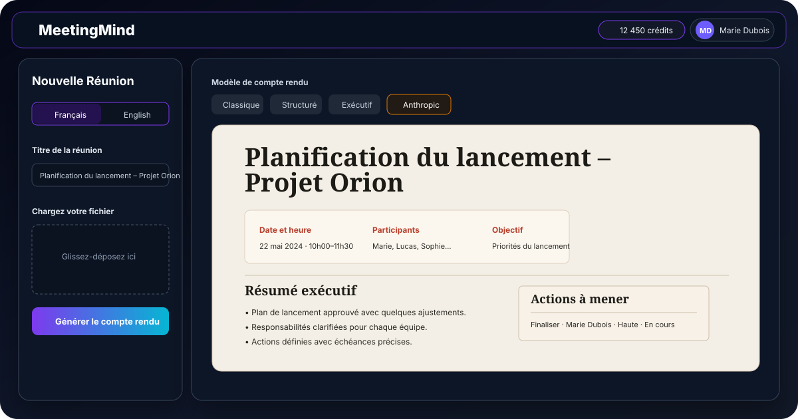
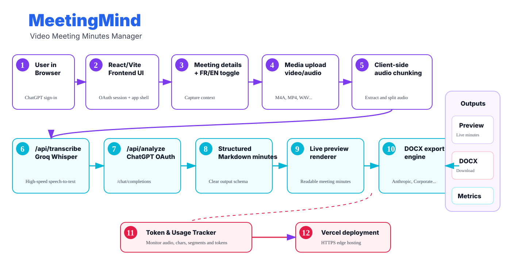

# MeetingMind — Video Meeting Minutes Manager

MeetingMind turns recorded video or audio meetings into structured minutes with a live preview and DOCX export.

**Live app:** https://video-meeting-minutes-manager.vercel.app/



## Highlights

- Upload video, MP4, M4A, or other browser-supported audio recordings.
- Extract, resample, and chunk audio locally in the browser with FFmpeg.
- Transcribe audio through `/api/transcribe` using Groq Whisper.
- Sign in with a ChatGPT account in the web UI.
- Generate structured minutes through `/api/analyze` using the signed-in ChatGPT OAuth session and the OpenAI-compatible `/chat/completions` path.
- No MiniMax key and no OpenAI API key are required for minutes generation.
- Generate French minutes by default or switch to English.
- Preview generated Markdown and export polished DOCX files with selectable templates.

## Authentication and model access

MeetingMind uses the same `openai-oauth` family used by Medusa's ChatGPT OAuth route, adapted for a hosted React/Vercel application:

1. `@openai-oauth/react` establishes the ChatGPT session in the browser.
2. `openaiAuthHeaders()` forwards the request-bound OAuth session only when `/api/analyze` is called.
3. The Vercel route reconstructs the credentials with `openaiCredentials()`.
4. `@openai-oauth/openai-client` adapts those credentials to the standard OpenAI JavaScript SDK.
5. Minutes are generated with `client.chat.completions.create(...)` — chat mode, not an API-key-backed model call.

Hosted browser sign-in is handled by the upstream Sign in with ChatGPT flow. When its companion browser extension is required, the UI surfaces the install link and lets the user resume sign-in.

The app does **not** store a shared model API key on the server. The server receives the connected user's request-bound ChatGPT authorization and account identifier for the analysis request.

## Application flow



1. Open the React/Vite application.
2. Sign in with ChatGPT.
3. Enter meeting title/date and choose French or English.
4. Upload a video, MP4, M4A, or audio recording.
5. Browser FFmpeg extracts mono 16 kHz audio and creates 90-second WAV chunks.
6. `/api/transcribe` sends each chunk to Groq Whisper (`whisper-large-v3`).
7. The merged transcript is sent to `/api/analyze` with the current ChatGPT OAuth headers.
8. `/api/analyze` selects an available GPT model and calls the ChatGPT OAuth transport through `/chat/completions`.
9. The app renders the Markdown minutes and usage data.
10. The result can be exported to DOCX.

## Model selection

By default, `/api/analyze` asks the connected account for its available model catalog and prefers, in order:

- `gpt-5.6-sol`
- `gpt-5.6-terra`
- `gpt-5.4-mini`
- `gpt-5.4`
- `gpt-5`

If model discovery is unavailable, the route falls back to `gpt-5`, matching Medusa's production-supported ChatGPT OAuth default. Set `CHATGPT_MODEL` to pin a specific model when desired.

## DOCX templates

- **Anthropic** — warm editorial style.
- **Corporate** — clean business style.
- **Modern** — lighter presentation style.
- **Executive** — board-report style.

The DOCX export uses the same Markdown source as the website preview.

## Project structure

```text
.
├── App.tsx                         # ChatGPT sign-in, upload, analysis, preview, export UI
├── components/
│   ├── MarkdownRenderer.tsx        # Web preview renderer
│   └── TokenTracker.tsx            # Usage/token display
├── services/
│   ├── docxService.ts              # Markdown-to-DOCX export
│   └── geminiService.ts            # FFmpeg, transcription, OAuth analysis flow
├── api/
│   ├── analyze.ts                  # ChatGPT OAuth chat-completions route
│   └── transcribe.ts               # Groq Whisper route
├── types.ts
└── docs/images/
```

## Quick start

### Prerequisites

- Node.js 20 or newer.
- `GROQ_API_KEY` for speech transcription.
- A ChatGPT account for minutes generation.
- A browser supported by the upstream hosted Sign in with ChatGPT flow.

### Install and run

```bash
npm install
npm run dev
```

Then open the local Vite URL and choose **Se connecter avec ChatGPT**.

### Validate

```bash
npm run lint
npm run build
```

## Environment variables

```bash
GROQ_API_KEY=your_groq_key

# Optional: pin the ChatGPT OAuth model.
# CHATGPT_MODEL=gpt-5.6-sol
```

There is intentionally no `MINIMAX_API_KEY` or `OPENAI_API_KEY` requirement for the generation path.

## Deploy to Vercel

1. Import this repository as a Vite project.
2. Use `npm run build` as the build command.
3. Use `dist` as the output directory.
4. Add `GROQ_API_KEY` to the project environment.
5. Optionally add `CHATGPT_MODEL` to pin the generation model.
6. Deploy.

The ChatGPT credential is supplied by each signed-in browser session rather than as a Vercel project secret.
